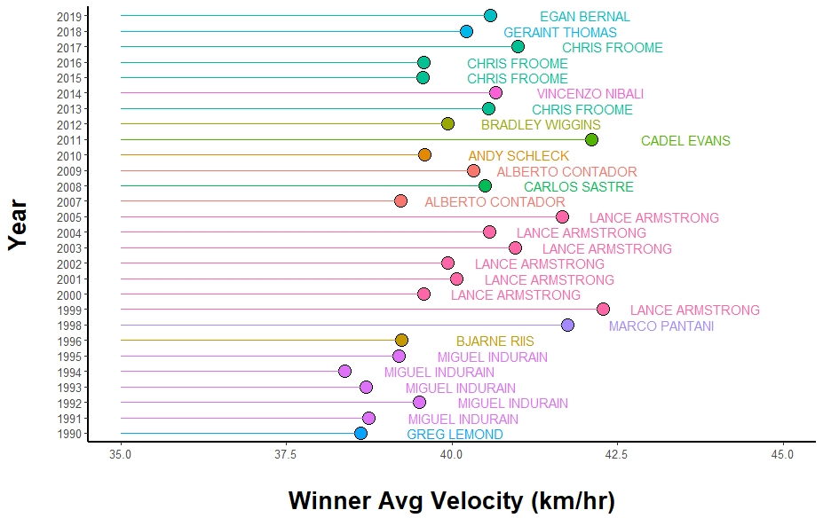
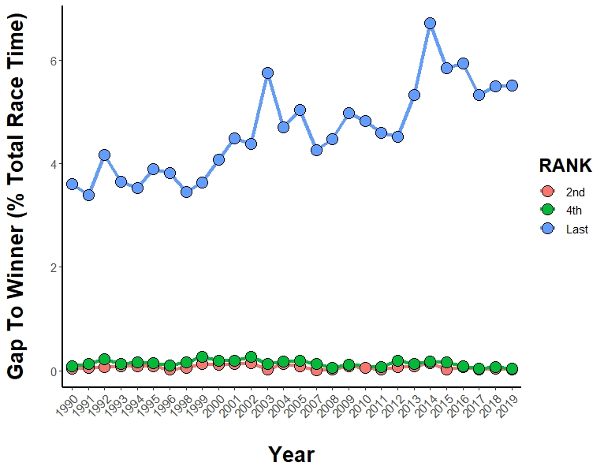
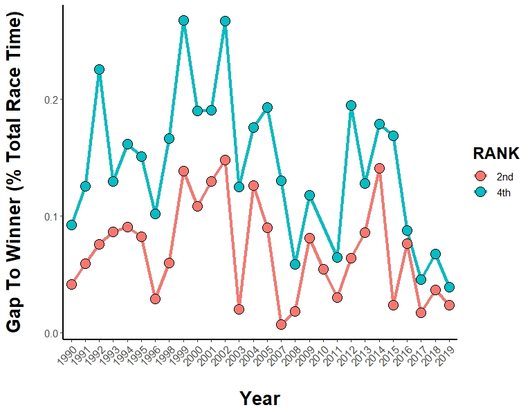

# Data Wrangling in R

## General Data Wrangling
**Code:** data_wrangle_tools.R

**Data:** data/skater_stats.csv

**Description:** This script contains general examples for the following wrangling tools:
1. `select()` - select specified columns
2. `filter()` - filter rows based on conditionals
3. `arrange()` - arrange rows based on values in specified column
4. `mutate()` - adds a new column and popuates values based on input
5. `group_by()` - allows user to group data by factor level
6. `rename()` - easy method for renaming a column
7. `str_replace()` - replace one str with another
8. `str_to_lower()` - convert all characters to lower case
9. `str_to_upper()` - convert all characters to upper case
10. `rbind()` - bind multiple data frames by row (resulting df is longer)
11. `full_join()` - bind multiple data frames by column (resulting df is wider)

## Tour de France Analysis
**Code:** tdf_analysis/tdf_analysis.R

**Data:** tdf_stats.csv

**Description:** This analysis includes an R script that cleans Tour de France overall results from 1990 to 2019. In particular, it provides good examples for `substr()`, `gsub()`, `group_by()`, and `mutate()`. It also provides examples of multiple ggplot2 functions and produces the following figures:

  

**What I learned:** For this analysis, I learned a lot about working with strings - particularly to convert race times and gap times from "xxH xx' xx''" format to "xx:xx:xx" format and eventually to strict hours (e.g., xx.xx hours). I also learned how to impliment `geom_text` within `ggplot2` to add data labels and how to adjust the angle of axis text.
